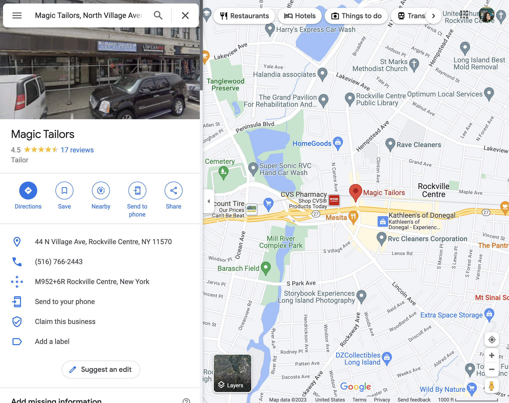

[back](../index.html)

# BC3997: Projects in Computer Science Proposal

### By Trinity Sazo

#### Problem

_Figure 1. Google Maps location of Magic Tailor's_

Magic Tailor's is a tailor shop in Rockville Centre, Long Island. Despite being in business for about 20 years, this small business does not have many technological systems in place: no website or way to manage customers. Post-COVID, many customers across all industries have relied and continue to rely on Google and business websites to decide when/where to take their business. Despite all this, Magic Tailor's has a highly loyal customer base (who help spread reach through word of mouth) which has helped maintain a steady stream of customers. Considering this, it would be nice to provide these loyal customers with a way to share Magic Tailor's more easily and grab the attention of those seeking tailoring services without solely relying on a referral. Moreover, the owner Geni Cepeda Zumba primarily speaks Spanish and does not have a lot of technical exposure past a mobile phone. Hence the website would primarily be customer-facing, with minimal to no services that require the owner to upkeep the site themselves.

As seen in Figure 1, Magic Tailor's does not currently have a website link connected to Google. According to research, Google Maps is the most downloaded and used map navigation app in the United States, even with Android phones having the app pre-installed. Having a website in a Google Maps Business Profile helps improve SEO measures to improve ranking in Google discovery in both maps and searches. Thus, creating a website helps with customer acquisition and customer retention, which for any small business, helps maintain stability.

---

#### User

Since the website is primarily customer-facing (as stated above), the user mainly focuses on consumers. Consumers are looking for tailoring services such as altercations and hems on formal attire like dresses, jackets, and pants. Users love consistency and clarity. As creatures of habit, it’s hard to switch tailors or search for the perfect service repeatedly; customers prefer finding a great tailor and choosing their services for all their tailoring needs. The process of choosing a good tailor relies on a few key metrics: performance, price, the form of payment, customer service skills/communication, and speed.

---

#### Goals

1. Create a functional static website with React
   - Home Page
   - Portfolio Page (previous projects) / About
   - Measurement Form
   - FAQ Page (if we can brainstorm FAQs)
   - Directions Page
2. Google Review Integration
3. Scheduling
4. Make the entire website translate into Spanish
   - Stretch goal: Translate into multiple languages seamlessly.
5. Implement Accessible Features
   - Light theme
   - Dark theme
   - Large links, buttons, and controls
   - Keyboard-only navigation
   - [React Accessibility](https://reactjs.org/docs/accessibility.html)
   - High contrast colors
6. Stretch goal: Come up with an easy way to streamline communication using SMS API to answer questions or a straightforward system for the owner to manage customer appointments/questions/updates.

---

#### Method

_Resources_

- React and Flask
  - [React/Flask Tutorial 1](https://towardsdatascience.com/build-deploy-a-react-flask-app-47a89a5d17d9)
  - [React/Flask Tutorial 2](https://www.geeksforgeeks.org/how-to-connect-reactjs-with-flask-api/)
  - [React/Flask Tutorial 3](https://dev.to/nagatodev/how-to-connect-flask-to-reactjs-1k8i)
- OpenAI / GPT-3 for translation / Google Translate API
  - [Google Translate API 1](https://github.com/matheuss/google-translate-api)
  - [Google Translate API 2](https://rapidapi.com/blog/google-translate-api-tutorial/)
  - [OpenAI API](https://openai.com/api/)
- [Google Review Integration](https://developers.google.com/my-business/content/review-data)
- [Scheduling](https://calendly.com/integration/embed)
- Website Hosting: [AWS](https://aws.amazon.com/getting-started/hands-on/host-static-website/)
- Website Inspiration:
  - [Magic Fitters](http://magicfitters.com/)
  - [Altercations](https://www.alterations.com/)

_Budget_

In order to host a website, hosting services are availble in multiple formats. In the interest of keeping costs low for myself and the owner (in upkeep of the website), I will be using AWS to host (in which the free tier doesn't exceed a few cents a month). The most expensive purchase will be a domain name, of which I settled on **magictailors.co** that lands at about $38 a year and increases annually, but for the first year will cost $11 when purchased through [GoDaddy](https://www.godaddy.com/). Thus, the project has a budget of $30 to cover the domain/domain protection services and any accrued costs from AWS.

_Timeline_

| date    | goal                                                                           | stretch goal                                                                   |
| :------ | :----------------------------------------------------------------------------- | :----------------------------------------------------------------------------- |
| jan. 30 | project proposal                                                               | background research started                                                    |
| feb. 6  | background research started   simple website made with React and Flask      | Host on AWS                                                                    |
| feb. 13 | Host on AWS + Balsamiq Wireframe                                               | integrate & display scheduling API                                             |
| feb. 20 | integrate & display scheduling API                                             | integrate & display Google Reviews API                                         |
| feb. 27 | integrate & display Google Reviews API                                         | start collecting content   finalize color palette                           |
| mar. 6  | integrate & display Google Reviews API                                         | start collecting content   finalize color palette                           |
| mar. 20 | start collecting content   finalize color palette                           | integrate color palette with dark/light themes that matches system preferences |
| mar. 27 | integrate color palette with dark/light themes that matches system preferences | continue content creation (images/text)                                        |
| apr. 3  | continue content creation (images/text)   check-in meeting with owner       | responsive layout                                                              |
| apr. 10 | responsive layout                                                              | start traslation work                                                          |
| apr. 17 | start traslation work                                                          | get a functional demo                                                          |
| apr. 24 | traslation work                                                                | tweak layout                                                                   |
| may. 1  | final project                                                                  |                                                                                |

#### Previous Experience

- COMS W6998: Advanced Web Design Studio
  - Amazon Alexa App
  - CRUD Flask App
  - CRUD Flask + OpenAI App

_thank you_
