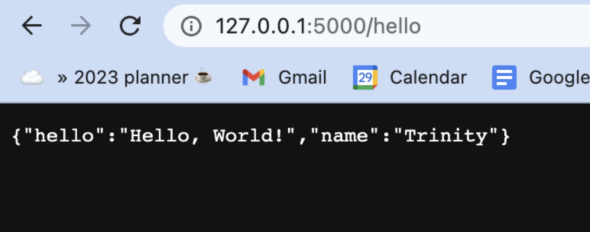

[back](../index.html)

# Setting up the basics

### Summary

- Followed most of [this React & Flask tutorial](https://dev.to/nagatodev/how-to-connect-flask-to-reactjs-1k8i) to set up both the front and back end of the website.


- Ran into an issue of flask not being imported properly? VS Code giving me a run for my money even though the installation was as simple as [following the official Flask installation.](https://flask.palletsprojects.com/en/2.2.x/installation/#)

  - I thought there were issues with Flask, but instead the IDE was giving non-fatal warnings that didn’t affect the local development server. Server ran on http://localhost:5000 without any problems.

- Ran into a seemingly easy (but annoying) CORS error but it was as simple as switching the proxy URL from http://localhost:3000 to http://127.0.0.1:5000, but nonetheless it took hours.

  - [Stack Overflow CORS Fix](https://stackoverflow.com/questions/45367298/could-not-proxy-request-pusher-auth-from-localhost3000-to-http-localhost500)
  - [GitHub CORS Fix](https://github.com/facebook/create-react-app/discussions/10149)

- Ultimately created my first React Flask app

### Background Research

#### What is React?

#### What is Flask?

#### What is Node.js?

#### Flask v.s. Node.js with React

| Topic                  | Flask                                                           | Node.js                                                                          |
| :--------------------- | :-------------------------------------------------------------- | :------------------------------------------------------------------------------- |
| Language               | Python                                                          | Chrome's V8 JS Engine                                                            |
| Architecture           | Non-blocking I/O requires non-blocking web servers              | Inherently provides non-blocking I/O                                             |
| Package Manager        | pip                                                             | npm                                                                              |
| Speed                  | Slower because of separate Python interpreter                   | Faster -> Just-In-Time compiler                                                  |
| Open Source            | Yes                                                             | Yes                                                                              |
| Community Support      | 2.3 K Watches, 51.4 K Stars, 13.7 K Forks on GitHub             | 2.9 K Watches, 71.9 K Stars, 17.6 K Forks                                        |
| Debugging              | Easier to Debug with Python debugger (no dependencies)          | Requires effort to debug but easier with IDE                                     |
| Maintenance            | Low                                                             | Higer (relatively)                                                               |
| Real-time applications | Inherently not suitable. Use socket.io for real-time use cases. | Inherently asynchronous                                                          |
| Libraries              | Mature and stable                                               | Less mature and stable                                                           |
| Code Quality           | It is exclusively created for the back end.                     | Sometimes compromised (frontend)                                                 |
| Integration            | Integration with existing system and applications               | Fairly new and requires the creation of custom or new libraries for integration. |

### Method

#### Project directory

Create the main project directory where the website will be stored

```
$ mkdir magic_tailors
$ cd magic_tailors
```

#### React frontend setup

Create the frontend react application by running:

```
$ npm create-react-app .
```

and then start the frontend application by running:

```
$ npm start
```

The default react application page should pop up in the browser; if not, paste the following link below in your browser:
**http://localhost:3000**

At this point, you should see the following:


Now we’ll move onto setting up the backend portion of the React Flask app.

#### Flask backend setup

Create and navigate into a new directory in the magic_tailors directory:

```
$ mkdir backend
$ cd backend
```

#### Virtual Environment

From here on out, it’s important to follow [Flask’s installation](https://flask.palletsprojects.com/en/2.2.x/installation/#) process. As noted there, virtual environments manage the dependencies for projects in both development and production. Virtual environments keep Python libraries independent from one another from project to project locally in an operating system.

#### Create an environment

Create a project folder and a venv folder within:

```
$ python3 -m venv venv
```

#### Activate the environment

Before working on the project, we need to activate it by running:

```
$ . venv/bin/activate
```

The shell prompt will change to show the name of the activated environment.

#### Install Flask

Within the activated environment, install Flask:

```
$ pip install Flask
```

Now Flask should be installed!

Staying in the backend directory, now create an app.py file.

```
$ touch app.py
```

Your folder structure will now look like 👇🏼


In the app.py script, create a simple API that returns your name and “Hello, World!”:

```
from flask import Flask

api = Flask(__name__)

@api.route('/hello')
def hello_world():
    response_body = {
        "name": "Trinity",
        "hello" :"Hello, World!"
    }

    return response_body
```

The code above contains a simple API which would be called by the react front end to get the `response_body` dictionary.

You might have noticed two things:

1. the GET http method is not specified here. Fortunately, view functions in Flask accept GET requests by default.
2. `response_body` dictionary being returned at the end of the function is not in `jsonify(response_body)` format. Flask can return a dictionary, which Flask then turns to JSON format automatically.

The backend has been successfully set up, you can test this by running your application.

```
flask run
```

Then navigate to the url **http://127.0.0.1:5000/hello**. You should see the dictionary `response_body` rendered in JSON format.


Add the following to your `.gitignore` file especially if you plan on pushing your code to Github.

```
/backend/venv
/backend/__pycache__
```

#### Connecting Flask endpoint to React front end

Return to the main `magic_tailors` directory where the frontend is located:

```
cd ..
```

#### Install `axios` library

```
npm install axios
```

#### `package.json`

Open the `package.json` file and add a proxy below the "private": true, line. This enables the Flask server on your local machine to be accessed by any API requests made by the front end as well as enabling relative paths when making those calls. For example, instead of using **http://localhost:5000/hello** you can simply make use of **/hello**.

```
\\ At the start of the file

"name": "magic_tailors",
 "version": "0.1.0",
 "private": true,
 "proxy": "http://127.0.0.1:5000",
```

Keep the package.json file open for a moment because you can add a neat feature. Similar to how React server automatically restarts upon file changes, you can also add this functionality to your Flask backend application. Connecting React to Flask offers this additional benefit.

Add another key and value under the scripts section
"start-backend": "cd backend && env/bin/flask run --no-debugger".

```
"scripts": {
    "start": "react-scripts start",
    "start-backend": "cd backend && venv/bin/flask run --no-debugger",
    "build": "react-scripts build",
    "test": "react-scripts test",
    "eject": "react-scripts eject"
  },
```

You can now initiate your backend server by running "npm run start-backend," which triggers the command specified in the package.json file. This command enters the "venv" directory in your backend folder and executes the "flask run" command.

The command includes the "--no-debugger" option to turn off the browser-based debugger. This is because the Flask backend only acts as a server to host the API endpoint.

#### `App.js`

Time to connect the API endpoint together with the frontend. Create a file `App.js` that contains the following:

```
import { useState } from 'react'
import logo from './logo.svg'
import './App.css'


function App() {

   const [profileData, setProfileData] = useState(null)

  function getData() {
    console.log("fetching python localhost");
    axios.get('/hello')
      .then((response) => {
        const res = response.data
        console.log(res)
      setProfileData(({
        profile_name: res.name,
        hello_world: res.hello}))
    }).catch((error) => {
      if (error.response) {
        console.log(error.response)
        console.log(error.response.status)
        console.log(error.response.headers)
        }
    })}

  return (
    <div className="App">
      <header className="App-header">
        
        <p>
          Edit <code>src/App.js</code> and save to reload.
        </p>
        <a
          className="App-link"
          href="https://reactjs.org"
          target="_blank"
          rel="noopener noreferrer"
        >
          Learn React
        </a>

        <p>To get your profile details: </p><button onClick={getData}>Click me</button>
        {profileData && <div>
              <p>Profile name: {profileData.profile_name}</p>
              <p>{profileData.hello_world}</p>
            </div>
        }
      </header>
    </div>
  );
}

export default App;
```

Now, everything should be connected! Go ahead and test:

1. Start your backend server using `npm run start-backend` in your terminal. This command can be run while you are in any directory; be it the base directory(flask_react) or the flask directory (backend)
2. Start your react server using `npm start` in the base directory

When you navigate to **http://127.0.0.1:3000** to view the React app you'll see the following:


After you click the button, then you should see this:


Now the Magic Tailor's backbones is up and running!
