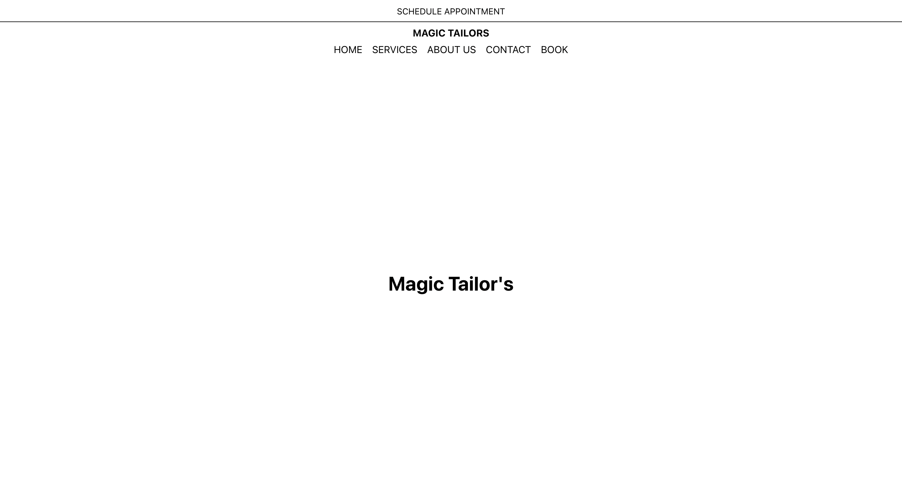
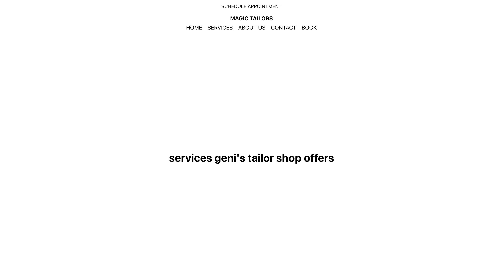
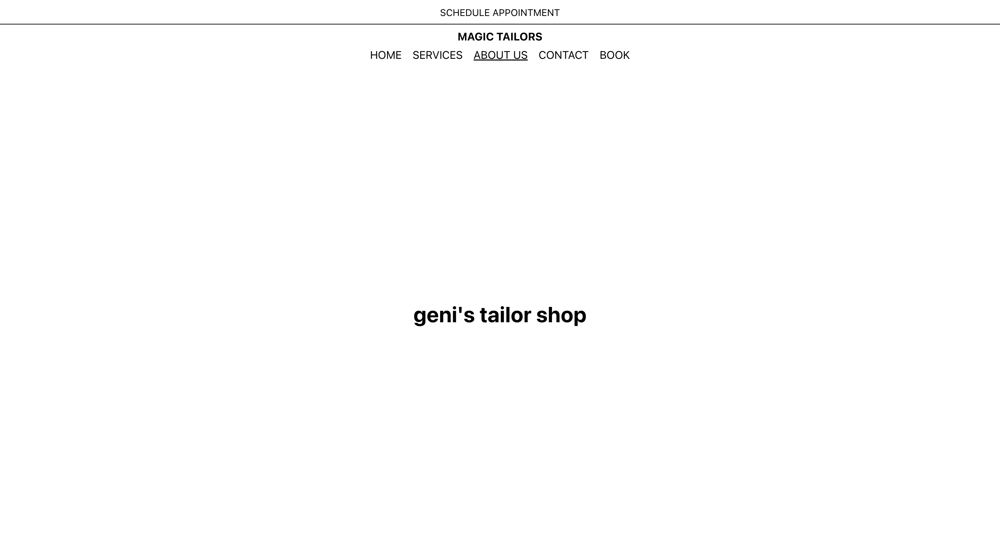
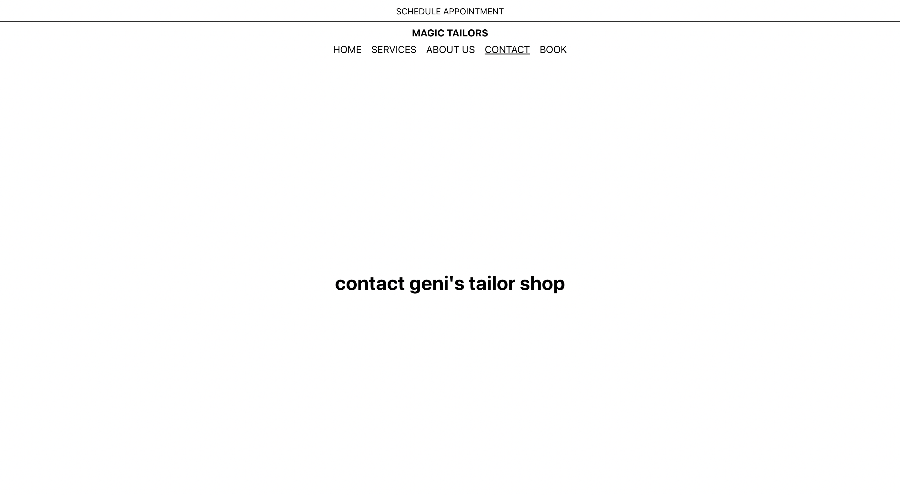

[back](../index.html)

# Design Update

### Summary

So, after making the wireframes, all that's left is to... create the actual app. Doing this seems expremely daunting as I'm pretty used to working with massive databases of internal documentation that already has preset styling to keep myself organized. Now it's up to me to have set text sizes and margins and colors.

I had to look into React navigation to figure out the multiple pages. To do so I found 3 resources I jumped around to understand the Navbar process more.

- [Github](https://react-bootstrap.github.io/components/navbar/)
- [GeeksForGeeks](https://www.geeksforgeeks.org/create-a-responsive-navbar-using-reactjs/)
- [CS Blog](https://blog.logrocket.com/creating-navbar-react/)

### Background Research

#### `react-router-dom`

https://www.geeksforgeeks.org/create-a-responsive-navbar-using-reactjs/

#### `styled-components`

https://www.geeksforgeeks.org/create-a-responsive-navbar-using-reactjs/

### What the site looks like!

Check out the differences [here](https://main.d1aum8d3sgp0hz.amplifyapp.com)

#### Home

#### Services

#### About

#### Contact

#### Book Now

