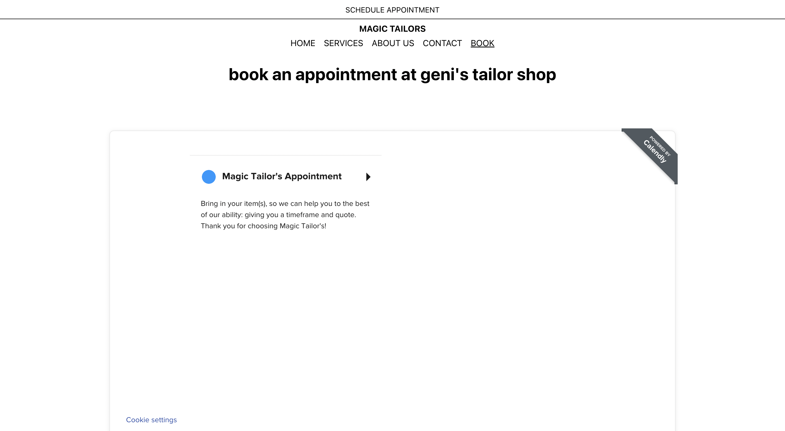

[back](../index.html)

# Google Places API

### Summary

This week was all about connecting the Google Maps Places API to the app so I could start getting real-time reviews to the page. After hours of watching YouTube videos and reading documentation on Amplify on AWS aand how to ensure I keep my API key secure and off the public domain of the internet, I was able to make a private and secure API call (since in order to host the website through AWS, all my code needs to be published online).

### Background Research

#### Why the Google Places API?

1.

### API Call

I didn't save all the resources that taught me and led me to my solution unfortunately. I created a very basic button to test if the API worked but didn't yet implement the Review feature into the website. This will be done when I get access to the business account to get access into the business details such as the store's Place ID (which I need to plug into the API call).

Code below:

```
import awsgi
from flask_cors import CORS
from flask import Flask, jsonify, request
from urllib.request import urlopen
import json
from token import api_key

app = Flask(__name__)
CORS(app)

# Constant variable with path prefix
BASE_ROUTE = "/hello"


@app.route(BASE_ROUTE)
def fetchMap():
    url = "https://maps.googleapis.com/maps/api/place/nearbysearch/json?location=-33.8670522,151.1957362&radius=500&types=restaurant&name=harbour&key={}".format(
        api_key)

    response = urlopen(url)
    data = response.read()
    dict = json.loads(data)

    print(dict)

    return dict


def handler(event, context):
    print('received event:')
    print(event)

    return awsgi.response(app, event, context)
```


