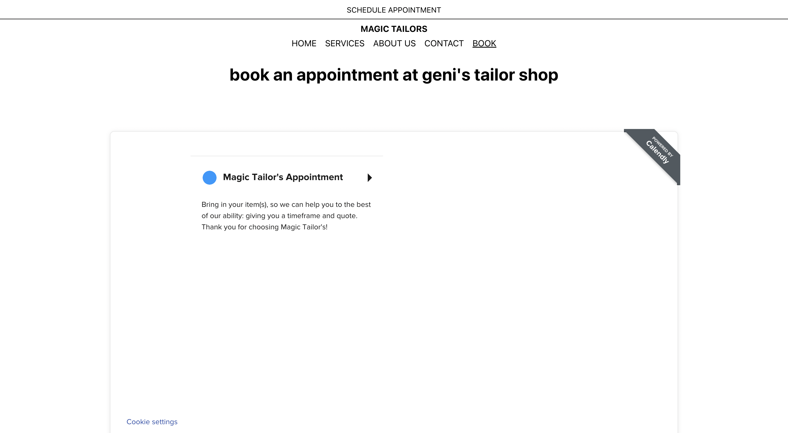

[back](../index.html)

# Logo & Content Gathering

### Summary

This week I decided to put the website creation breifly on pause to source some content -- stock photos, logos, operation hours, current marketing of the tailor shop, and mission/purpose of the shop. The content of the shop required me to travel out to Long Island to visit the shop in person, take some photos for logo reference and capture their current marketing style. I wanted to ensure the marketing presented on the site was the same voice as the one the store portrayed to their current customers.

### Logo

I used Procreate to draw the logo. 

