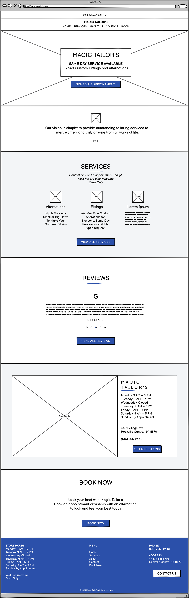
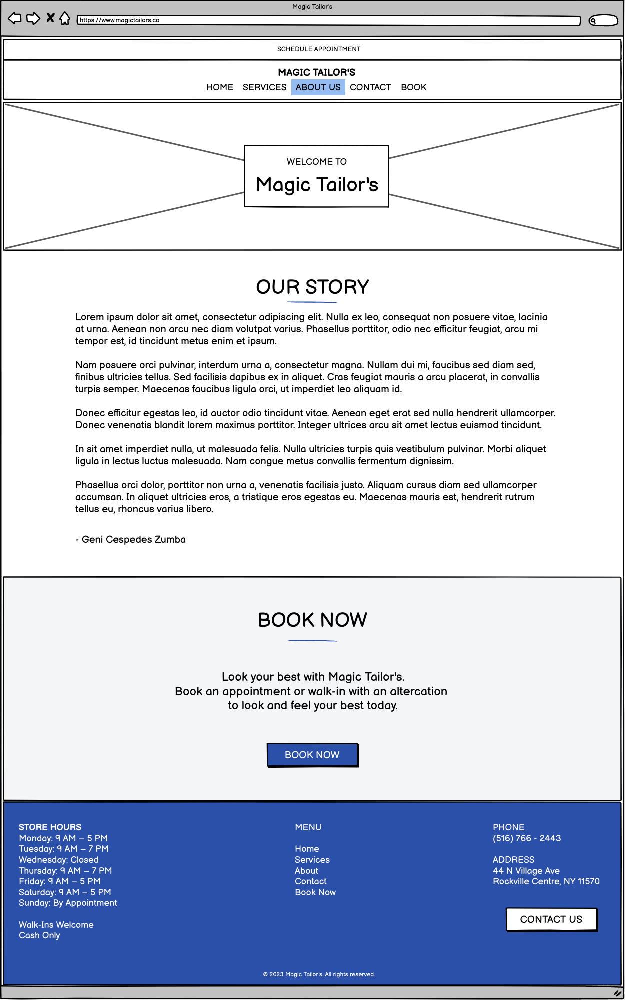
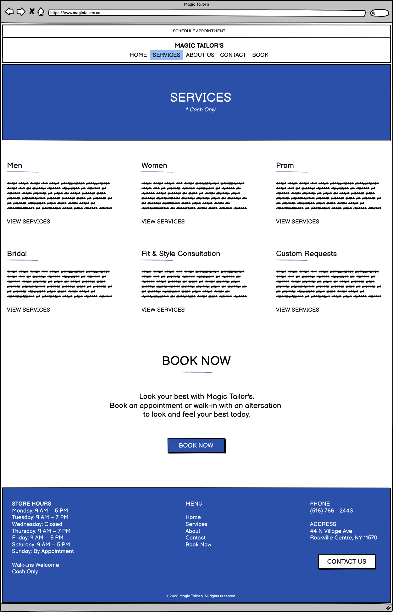
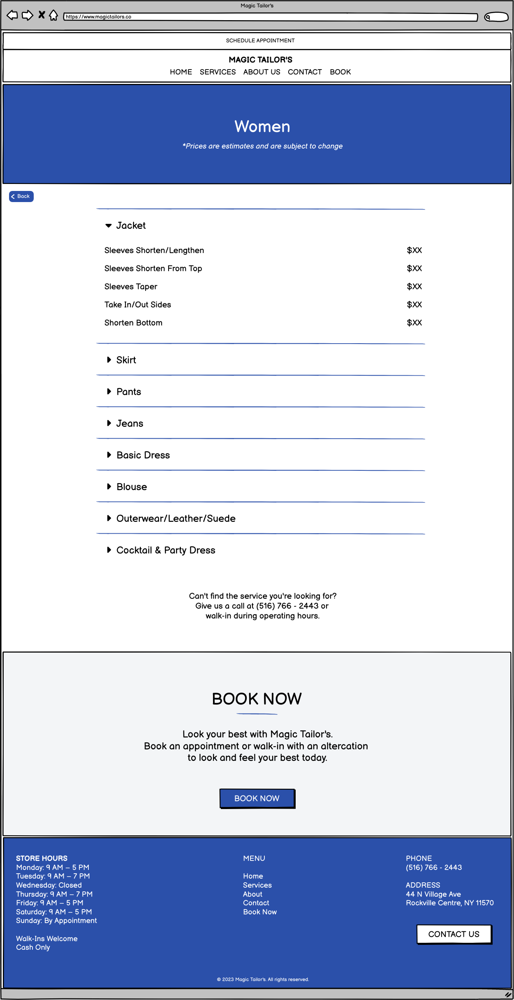
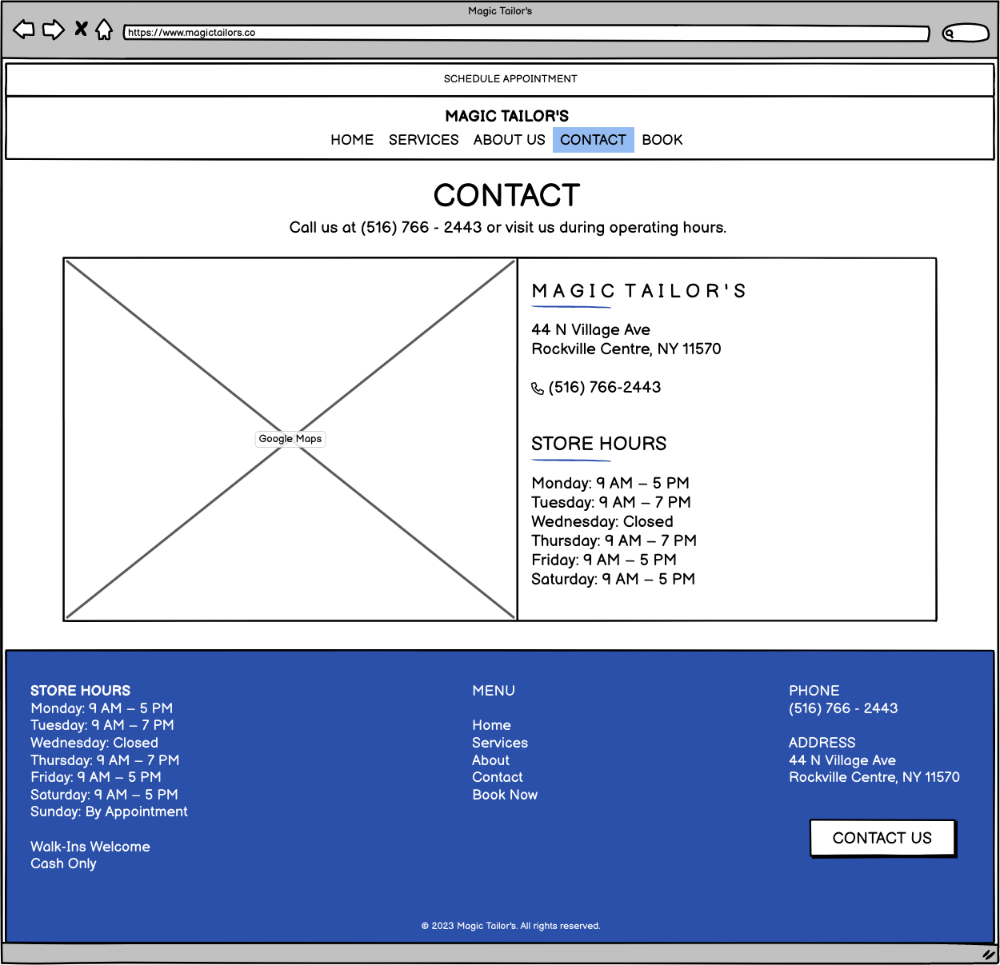
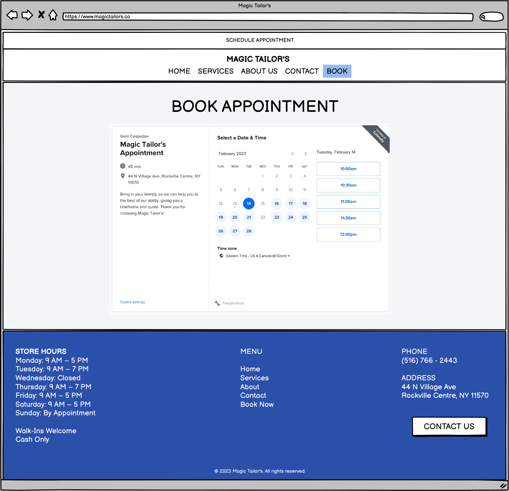
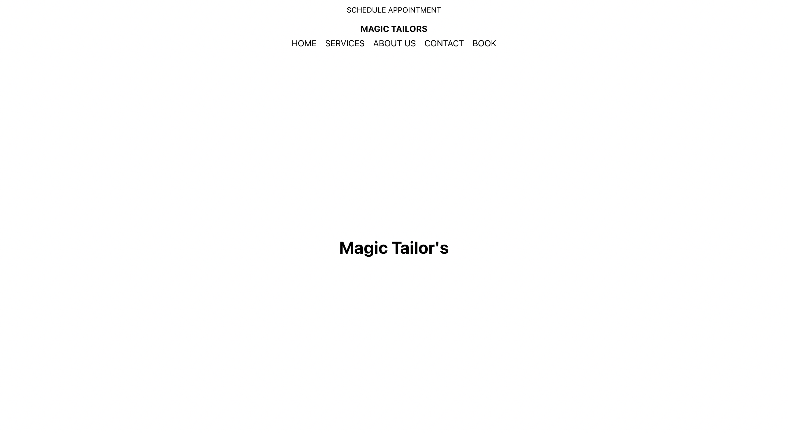

[back](../index.html)

# Midterm Presentation

### Summary

For my class project, I decieded to create a business website to help market and streamline appointments to a small tailor shop. This tailor shop is named Magic Tailor's and is owned by a woman named Geni Cespedes in Rockville Centre, Long Island.

#### Who is Geni?

Geni is an immigrant from Bolivia. She moved here 35 years ago and found work in being a seamstress. With the help of her husband, she started Magic Tailor's after years of honing in her skills and saving up the income.

#### Below are images to demonstrate my progress

**Week 1: AWS Hosting and React**

**Week 2: Wireframes**

_Home Page_

_About Page_

_Services Page_

_Service Item Page_

_Contact Page_

_Appointments Page_

_Reviews Page_

_Color Palette_

Lastly, to make sure I don't go crazy with colors across the site, I wanted to cement a color palette that the tailor shop already uses to reflect it in the site itself.

**Week 3: Scheduling & Update**
_Calendly Integration_

_Home_

_Services_

_About_

_Contact_

**Week 4: AWS API Struggles**
I don't have an image showing the visible process, but I needed to see how to ensure AWS could connect to Google Places API and I was able to make the connection here! This is to add reviews to the page (hopefully).

**Week 5: Logo & Content**

**Week 6: Redesign**

**Week 7: Spring Break**

**Week 8: Miderm Presentation**

# Perfection is the enemy of progress.

I understand this deeply now lol.
