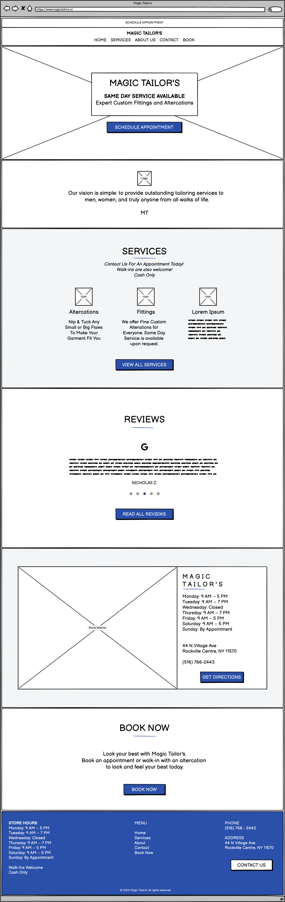
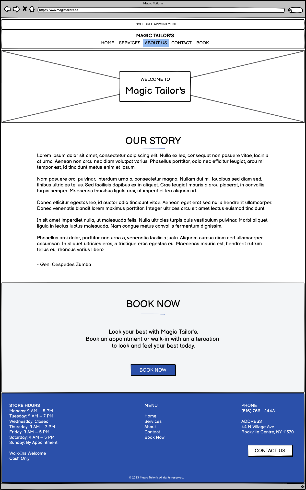
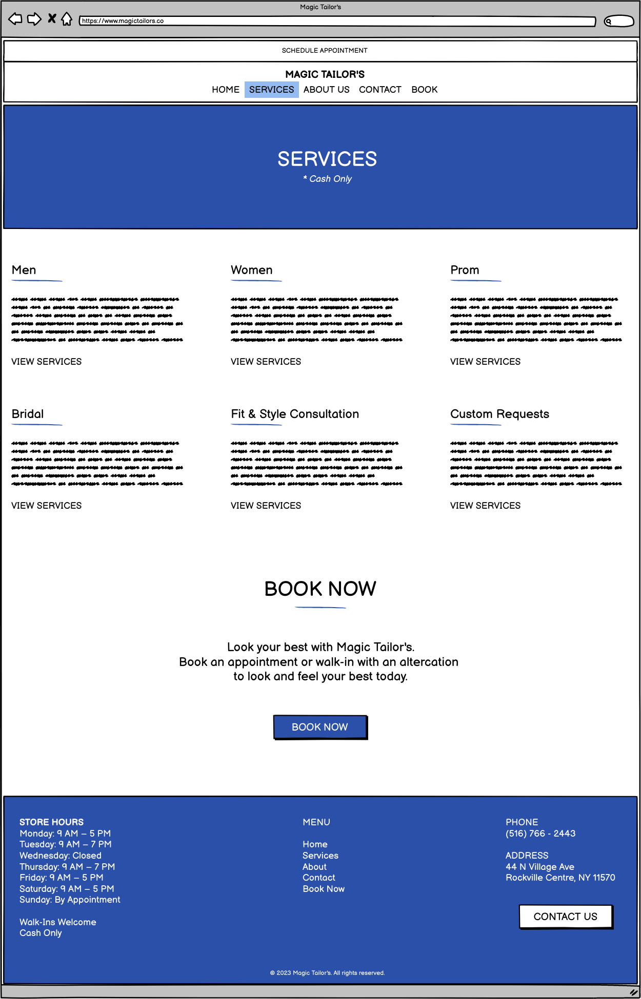
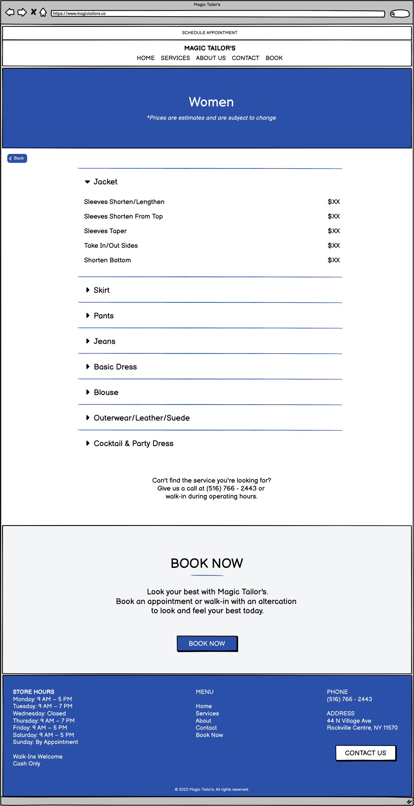
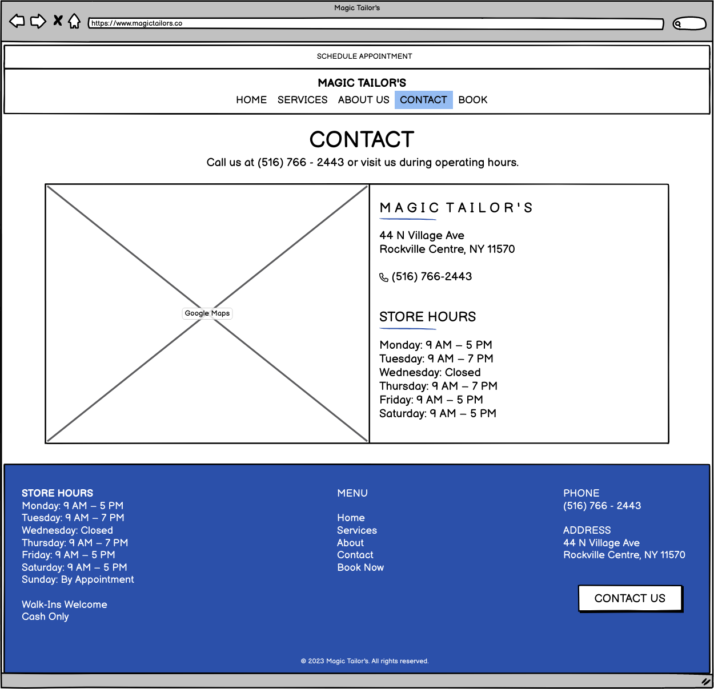
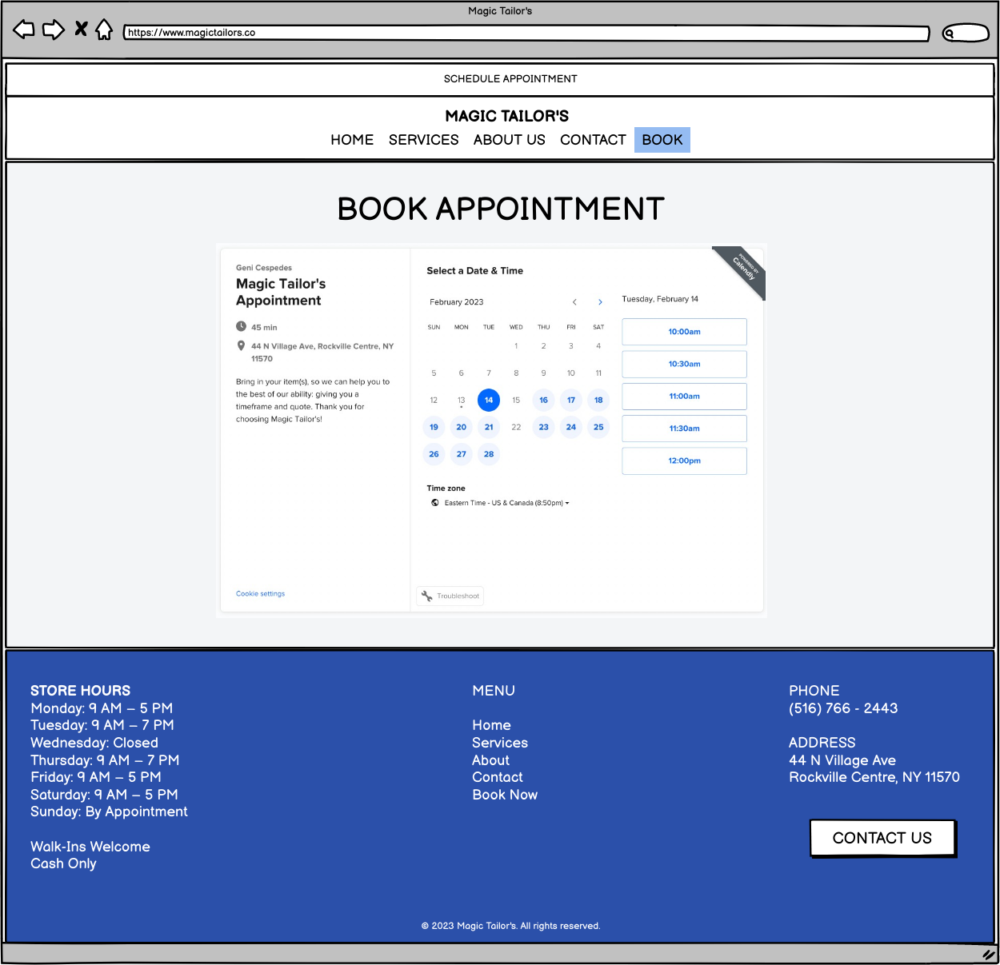
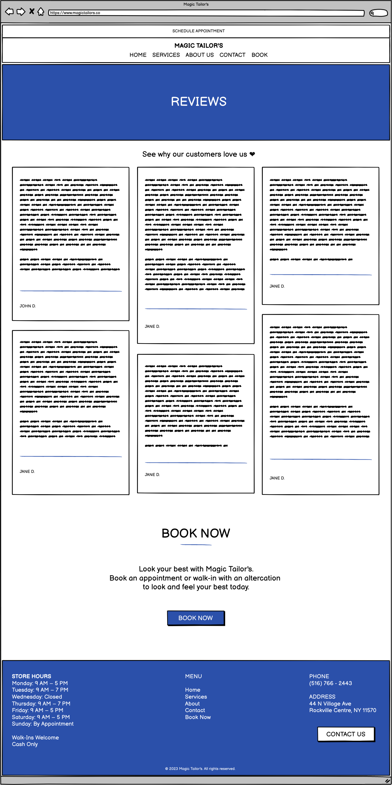
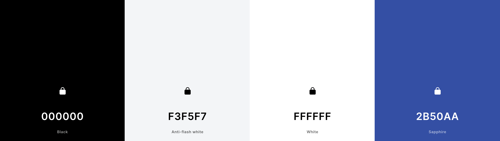

[back](../index.html)

# Wireframes

To ensure that going forward with coding, and making sure I keep myself organized with my React.js coding (templates, components, etc.) I wanted to create wireframes that I could reference and show the tailor shop owner for approval.

To user test, go to this link [here](https://balsamiq.cloud/syvgac7/p4qvfxy/rCA29?f=N4IgUiBcAMA0IDkpxAYWfAMhkAhHAsjgFo4DSUA2gLoC%2BQA%3D).

Below is what I designed!

### Home Page

### About Page

### Services Page

#### Service Item Page

### Contact Page

### Appointments Page

### Reviews Page

# Color Palette

Lastly, to make sure I don't go crazy with colors across the site, I wanted to cement a color palette that the tailor shop already uses to reflect it in the site itself.

Get the palette [here](https://coolors.co/000000-f3f5f7-ffffff-2b50aa).
